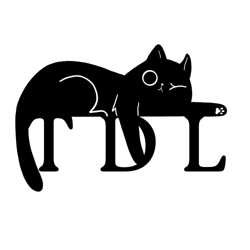

<br />
<div align="center">
  <a href="https://github.com/itchiii16/automataproject">
    
  </a>

  <h3 align="center">TDL - Your Productivity Companion</h3>

  <p align="center">
    A minimal, beautiful, and feature-rich To-Do List Dashboard built with Vanilla JavaScript.
  </p>
</div>

## 📖 About The Project

**TDL** is not just a list; it's a productivity dashboard designed to help you stay focused. It replaces the clutter of complex apps with a clean, two-view interface (Landing & Dashboard) and provides visual feedback on your progress.

It uses **Local Storage** to save your data, meaning your tasks persist even if you close the browser, without needing a backend server.

## ✨ Key Features

* **Two-View Architecture:** A sleek Landing Page for a warm welcome and a feature-rich Dashboard for management.
* **Dark/Light Mode:** Fully persistent theme toggle that switches the entire UI (and icons) to reduce eye strain.
* **Visual Analytics:**
    * **Donut Chart:** Visualizes completion percentage.
    * **Category Bars:** Breaks down tasks by Work, Personal, School, Ideas, and Urgent.
    * **Activity Log:** Tracks your recent actions (Task created, completed, etc.).
* **Smart Tagging:** Color-coded tags for quick visual filtering.
* **Status Workflow:** Move tasks from "To Do" -> "In Progress" -> "Done" using a simple dropdown badge.
* **Drill-Down Modals:** Click on any stat card (e.g., "Urgent") to see a popup filtered list of just those tasks.
* **Data Persistence:** All tasks, themes, and activity logs are saved automatically to the browser's Local Storage.

## 🛠️ Built With

*  **HTML5** - Semantic structure.
*  **CSS3** - Custom flexbox/grid layouts, animations, and variables.
*  **JavaScript (ES6+)** - DOM manipulation, logic, and local storage handling.
* **FontAwesome** - For UI icons.

## 🚀 Getting Started

To run this project locally, you don't need to install anything complex. It runs directly in the browser.

### Prerequisites

* A modern web browser (Chrome, Edge, Firefox, Safari).

### Installation

1.  **Clone the repo**
    ```sh
    git clone https://github.com/itchiii16/ToDoList.git
    ```
2.  **Navigate to the project folder**
3.  **Open `index.html`** in your browser.
    * *Recommended:* Use the "Live Server" extension in VS Code for the best experience.

## 📂 Project Structure

```text
TDL/
├── index.html      # The main HTML structure (Landing + Dashboard)
├── style.css       # All styles, animations, and Dark Mode overrides
├── script.js       # Logic for tasks, charts, storage, and UI toggles
├── logo.png        # The branding asset
└── README.md       # Project documentation
